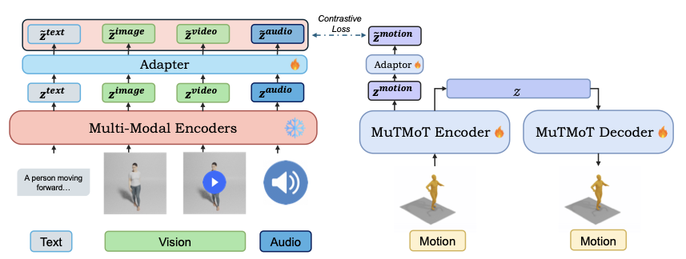
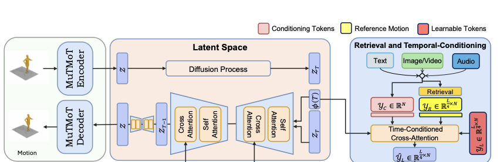

# MotionBind

**Multi-Modal Human Motion Alignment for Cross-Modal Retrieval, Recognition, and Generation**

MotionBind extends LanguageBind to incorporate human motion, enabling cross-modal retrieval, zero-shot action recognition, and any-to-motion generation from text, video, or audio.

## Architecture

MotionBind consists of two main components:

### MuTMoT (Multi-Scale Temporal Motion Transformer)

MuTMoT is a transformer-based hierarchical encoder-decoder architecture that encodes motion sequences into compact embeddings aligned with a shared multi-modal space. It captures motion dynamics at multiple temporal resolutions, producing representations that reflect both fine-grained pose transitions and high-level action semantics.

<p align="center">

</p>

### REALM (Retrieval-Augmented Latent diffusion Model)

REALM is a retrieval-augmented latent diffusion model that generates motion sequences conditioned on any modality (text, video, or audio). It operates in the compact latent space defined by the MuTMoT encoder and uses temporal conditioning with learnable frame tokens that dynamically attend to conditioning context throughout the denoising process.

<p align="center">

</p>

## Citation

```BibTeX
@inproceedings{kinfu2025motionbind,
  title={MotionBind: Multi-Modal Human Motion Alignment for Retrieval, Recognition, and Generation},
  author={Kaleab A Kinfu and Rene Vidal},
  booktitle={The Thirty-ninth Annual Conference on Neural Information Processing Systems},
  year={2025},
  url={https://openreview.net/forum?id=sUjwDdyspc}
}
```